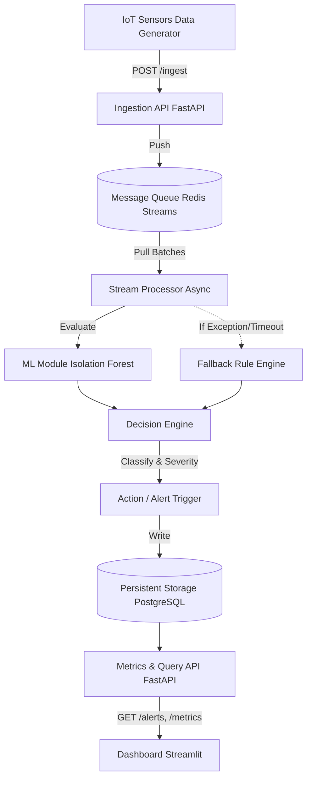

# Real-Time Urban Intelligence & Decision System (RTUIDS)

[](https://opensource.org/licenses/MIT)
[](https://www.python.org/downloads/)
[](https://fastapi.tiangolo.com/)

RTUIDS is a distributed, high-throughput anomaly detection pipeline designed for Smart Cities. It processes simulated IoT sensor data (temperature, pollution, traffic volume) in real-time to identify anomalies using Machine Learning (Isolation Forests), while guaranteeing high availability via a deterministic Rule Engine circuit breaker.

**This is a production-style, system-design focused architecture.**

---

## 🏗️ Architecture Overview



### Key Engineering Decisions
* **Decoupled Ingestion**: FastAPI writes to Redis Streams (memory-fast queue) instead of a direct DB write. This guarantees zero dropping of requests under heavy burst loads.
* **Idempotency & Backpressure**: The `/ingest` endpoint blocks duplicate `event_id` submissions and returns `503 Service Unavailable` if the internal message queue exceeds thresholds.
* **Batch Processing**: A background consumer group (`XREADGROUP`) pulls data from Redis in batches of 100, dramatically increasing Machine Learning inference vectorization speeds.
* **Circuit Breaker Pattern**: ML models are inherently brittle (OOM issues, prediction timeouts). If the `scikit-learn` module fails, the Stream Processor immediately routes the fallback batch to a deterministic Rule Engine to guarantee continuous 100% telemetry uptime.

---

## 🚀 Getting Started

### 1. Start Infrastructure
We use Docker Compose to spin up Redis (Message Queue) and PostgreSQL (Persistent Storage).
```bash
docker compose up -d
```

### 2. Setup Python Environments 
*Ensure you have Python 3.10+ installed.*
```bash
# Create and activate virtual environment
python -m venv venv
source venv/bin/activate  # On Windows use `venv\Scripts\activate`

# Install Backend and Generator Dependencies
pip install -r backend/requirements.txt
pip install -r generator/requirements.txt
pip install -r dashboard/requirements.txt
```

### 3. Run the Backend API & Stream Processor
The processor runs as a background asyncio task alongside the API.
```bash
cd backend
uvicorn app.main:app --reload
```
*API docs available at: http://localhost:8000/docs*

### 4. Run the Streamlit Dashboard
In a new terminal window (with venv activated):
```bash
cd dashboard
streamlit run app.py
```
*Dashboard available at: http://localhost:8501*

### 5. Trigger the Data Flood!
In a third terminal window, launch the high-concurrency generator to simulate 1000+ IoT requests per second.
```bash
cd generator
python generator.py
```

---

## 📁 Repository Structure

* `backend/`: Core FastAPI server, Redis Stream Consumer, SQLAlchemy DB Models.
* `backend/app/ml/`: Unsupervised Isolation Forest implementation.
* `backend/app/engines/`: Complex classification logic and fallback Rule Engine.
* `dashboard/`: Auto-refreshing Streamlit frontend with Plotly visualizations.
* `generator/`: `httpx` and `asyncio` script designed to load-test the API ingestion layer.

## License
MIT
